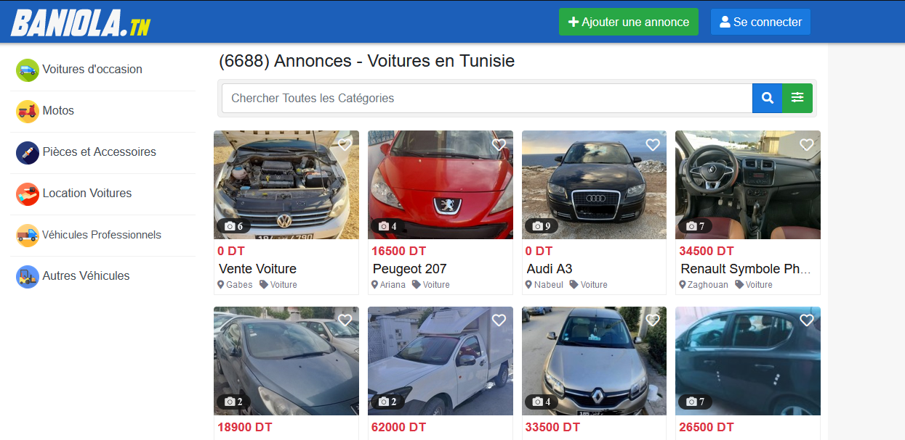
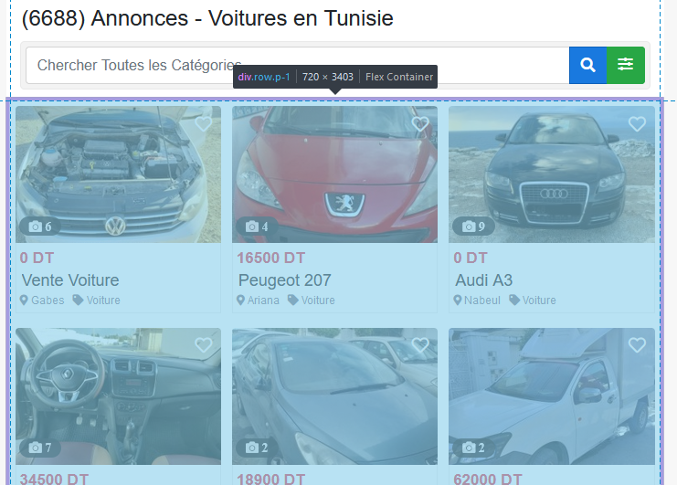
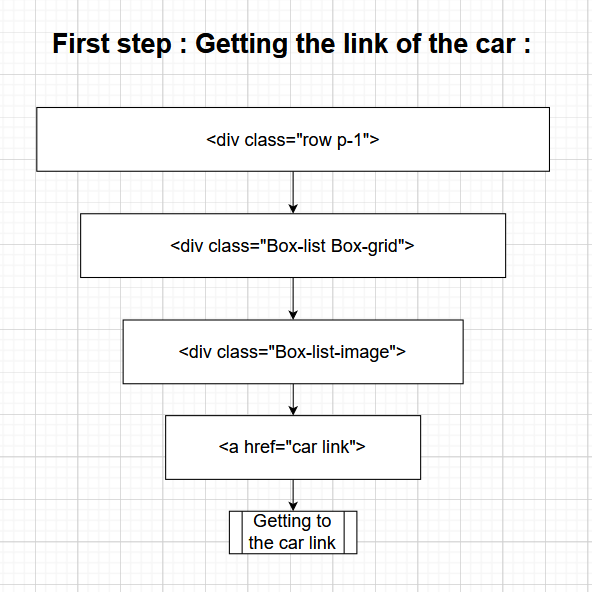
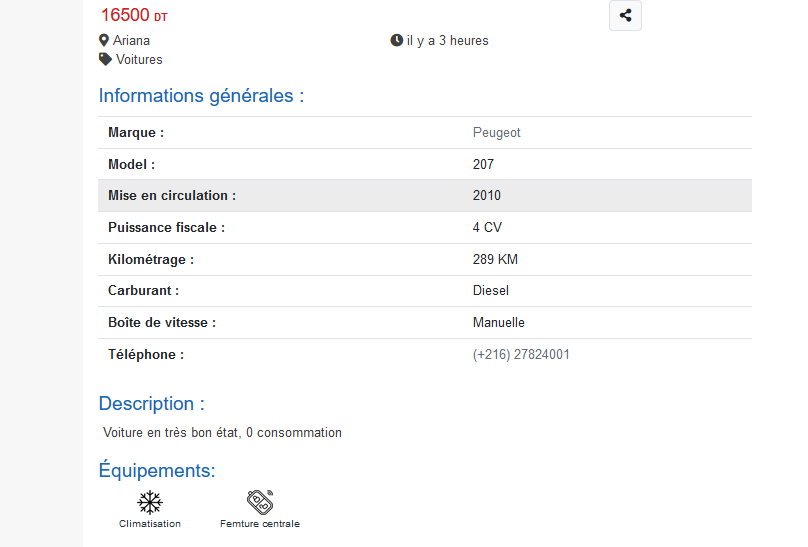
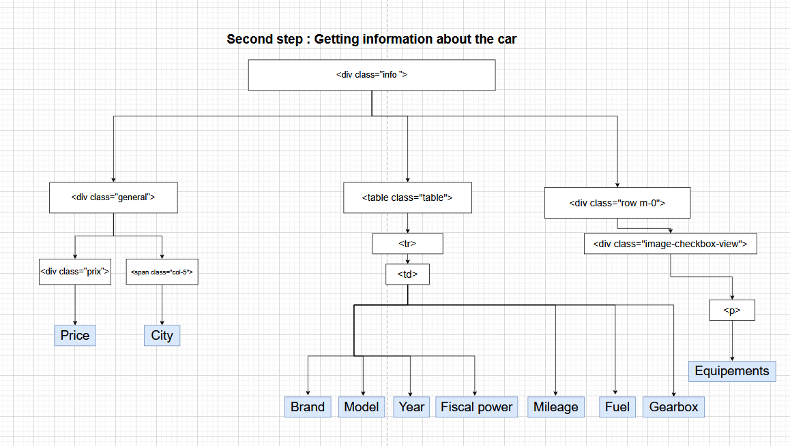

# Web Scraping Baniola.tn to Collect Information about Used Cars

# Summary

Gain knowledge about the website [baniola.tn](http://baniola.tn/) and acquire the skills to perform web scraping on it.

## Website Architecture :

This website consist of 4 main components :

[https://baniola.tn/voitures-occasion](https://baniola.tn/voitures-occasion)

[https://baniola.tn/motos](https://baniola.tn/motos)

[https://baniola.tn/pieces_et_accessoires](https://baniola.tn/pieces_et_accessoires)

[https://baniola.tn/location-voitures](https://baniola.tn/location-voitures)

## We will be working on used cars :

here’s a preview of the website :



After taking a look on the html code we can see that all the cars are contained in div :

```html
<div class="row p-1">
			<!-- start box annonce -->
</div>
```



And each announcement is contained in a div :

```html
 <div class="Box-list Box-grid">
 </div> 
```

### Steps of getting the car information :

1. In order to retrieve all details regarding a particular car, we must obtain its corresponding link.
2. Upon clicking the link, we can then access all the information pertaining to the specific car.
- Steps to get the link of the car :



- We will take `**General informations /``Equipment`**



### Getting all the information needed from the website :



> The final task is to develop a Python script capable of extracting data for all cars from the website through web scraping.
> 

# Web Scraping Baniola.tn

This is a Python script for web scraping car information from the website baniola.tn. The script imports several libraries such as requests, BeautifulSoup, pandas, numpy, and unidecode.

The script defines three functions.

1. The `get_car_info` function gets information related to a specific car from its URL. It extracts information such as price, city, brand, model, year, mileage, fuel type, gearbox type, and equipment. The function takes in the car URL and a dictionary of parameters to store the extracted information.
2. The `get_cars_url` function gets the URLs of all cars on a specific page. It takes in the basic URL for the website and the page number, and returns a list of URLs for all cars on that page.
3. The `main` function is the main entry point of the script. It initializes an empty dictionary to store the extracted car information. It then loops over all pages on the website, gets the URLs of all cars on each page, and then calls the `get_car_info` function to extract the information for each car. The extracted information is stored in the dictionary. Finally, the function returns the dictionary of extracted information.

After calling the `main` function, the script creates a pandas DataFrame from the extracted information and exports it as a CSV file.
